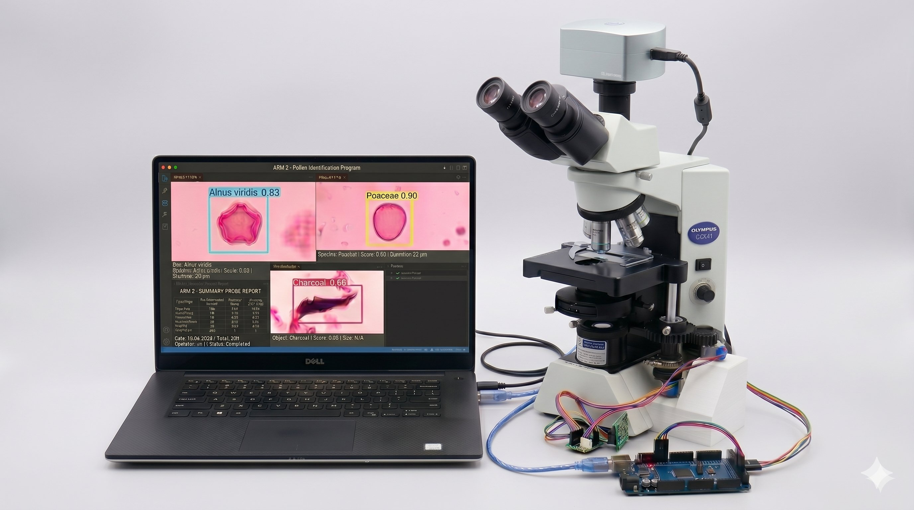

# fossil_pollen — ARM-2

Automated detection and classification of fossil pollen grains in microscope images, evolving across two phases:

| | Phase 1 | Phase 2 |
|---|---|---|
| **Model** | YOLOv8 | RT-DETR-L |
| **Stage** | Manual | Motorised (Arduino + 2× stepper) |
| **mAP@50** | 0.620 | **0.751** |

---

## Model performance

### YOLO vs RT-DETR-L comparison

| Metric | YOLOv8 (Phase 1) | RT-DETR-L (Phase 2) | Δ |
|---|---:|---:|---:|
| Precision | 0.679 | **0.811** | +0.132 |
| Recall | 0.603 | **0.734** | +0.131 |
| mAP@50 | 0.620 | **0.751** | +0.131 |
| mAP@50–95 | 0.482 | **0.590** | +0.108 |

RT-DETR-L: 310 layers · 32 M params · 100 epochs · Tesla T4 (Google Colab, ~5 h).

<p align="center">
  
  <br/><em>RT-DETR-L training/validation losses, mAP and P–R curves over 100 epochs.</em>
</p>

<details>
<summary><strong>Per-class RT-DETR results — 24 classes (click to expand)</strong></summary>

| Taxon | Val Images | Instances | P | R | mAP50 | mAP50-95 |
|---|---:|---:|---:|---:|---:|---:|
| **all** | **401** | **546** | **0.811** | **0.734** | **0.751** | **0.590** |
| Aconitum | 2 | 2 | 0.904 | 0.500 | 0.495 | 0.495 |
| Alnus viridis | 15 | 16 | 0.928 | 0.802 | 0.866 | 0.665 |
| Apiaceae | 9 | 9 | 1.000 | 0.939 | 0.995 | 0.765 |
| Artemisia | 62 | 69 | 0.869 | 0.863 | 0.847 | 0.605 |
| Asteraceae | 6 | 6 | 0.967 | 0.833 | 0.835 | 0.644 |
| Betula pendula | 23 | 24 | 0.837 | 0.875 | 0.834 | 0.659 |
| Charcoal | 38 | 40 | 0.767 | 0.906 | 0.849 | 0.572 |
| Chenopodiaceae | 26 | 26 | 0.952 | 0.771 | 0.832 | 0.652 |
| Convolvulus | 2 | 2 | 0.452 | 0.500 | 0.495 | 0.446 |
| Cyperaceae | 8 | 8 | 0.960 | 0.125 | 0.127 | 0.101 |
| Fagus | 2 | 2 | 0.482 | 0.500 | 0.495 | 0.396 |
| Galium | 1 | 1 | 0.430 | 1.000 | 0.995 | 0.895 |
| Juniperus | 4 | 4 | 1.000 | 0.437 | 0.495 | 0.396 |
| Lycopodium | 74 | 79 | 0.954 | 0.987 | 0.984 | 0.762 |
| Other_pollen | 19 | 20 | 0.860 | 0.350 | 0.363 | 0.281 |
| Pediastrum boryanum | 6 | 6 | 0.626 | 0.566 | 0.679 | 0.486 |
| Pediastrum integrum | 14 | 14 | 0.767 | 0.571 | 0.753 | 0.496 |
| Picea | 3 | 3 | 0.738 | 1.000 | 0.913 | 0.780 |
| Pine | 123 | 138 | 0.901 | 0.942 | 0.959 | 0.800 |
| Pinus stomata | 1 | 1 | 0.885 | 1.000 | 0.995 | 0.895 |
| Poaceae | 56 | 57 | 0.821 | 0.860 | 0.868 | 0.676 |
| Rumex | 9 | 9 | 0.688 | 0.667 | 0.720 | 0.537 |
| Salix | 8 | 8 | 0.728 | 0.625 | 0.629 | 0.509 |
| Thalictrum | 2 | 2 | 0.940 | 1.000 | 0.995 | 0.646 |

</details>

<details>
<summary><strong>Per-class YOLO results — 32 classes (click to expand)</strong></summary>

| Class | Images | Instances | P | R | mAP@50 | mAP@50–95 |
|---|---:|---:|---:|---:|---:|---:|
| all | 328 | 448 | 0.679 | 0.603 | 0.620 | 0.482 |
| Acer | 2 | 2 | 0.151 | 0.500 | 0.511 | 0.410 |
| Alnus viridis | 12 | 13 | 1.000 | 0.741 | 0.943 | 0.681 |
| Apiaceae | 10 | 10 | 1.000 | 0.854 | 0.914 | 0.692 |
| Artemisia | 46 | 52 | 0.902 | 0.923 | 0.942 | 0.707 |
| Betula pendula | 14 | 15 | 0.567 | 0.933 | 0.826 | 0.655 |
| Botryococcus | 3 | 3 | 0.000 | 0.000 | 0.256 | 0.242 |
| Charcoal | 33 | 35 | 0.705 | 0.943 | 0.892 | 0.627 |
| Chenopodiaceae | 17 | 17 | 0.847 | 0.979 | 0.971 | 0.711 |
| Corylus | 2 | 2 | 0.652 | 1.000 | 0.663 | 0.548 |
| Cyperaceae | 6 | 6 | 0.656 | 0.333 | 0.367 | 0.281 |
| Equisetum | 2 | 2 | 0.000 | 0.000 | 0.081 | 0.059 |
| Ferns | 21 | 22 | 0.886 | 0.709 | 0.833 | 0.632 |
| Filipendula | 1 | 1 | 1.000 | 0.000 | 0.045 | 0.032 |
| Fraxinus | 7 | 7 | 0.504 | 0.436 | 0.538 | 0.428 |
| Gymnosperms | 5 | 5 | 0.727 | 0.545 | 0.588 | 0.499 |
| Juglans | 3 | 3 | 1.000 | 0.000 | 0.191 | 0.153 |
| Juniperus | 3 | 3 | 1.000 | 0.000 | 0.129 | 0.129 |
| Larix | 1 | 1 | 1.000 | 0.000 | 0.083 | 0.066 |
| Lycopodium | 45 | 48 | 0.793 | 0.958 | 0.958 | 0.759 |
| Others | 3 | 3 | 0.475 | 0.333 | 0.350 | 0.315 |
| Pediastrum boryanum | 4 | 4 | 0.668 | 0.750 | 0.808 | 0.461 |
| Pediastrum integrum | 12 | 13 | 0.758 | 0.769 | 0.888 | 0.597 |
| Picea | 3 | 3 | 0.408 | 0.667 | 0.631 | 0.539 |
| Pine | 96 | 106 | 0.850 | 0.964 | 0.971 | 0.802 |
| Pinus stomata | 1 | 1 | 0.457 | 1.000 | 0.995 | 0.895 |
| Plantago | 2 | 2 | 0.640 | 0.919 | 0.828 | 0.630 |
| Poaceae | 48 | 49 | 0.744 | 0.959 | 0.906 | 0.726 |
| Quercus | 2 | 2 | 1.000 | 0.000 | 0.114 | 0.101 |
| Rumex | 4 | 4 | 0.451 | 1.000 | 0.674 | 0.572 |
| Salix | 9 | 9 | 0.554 | 0.667 | 0.600 | 0.445 |
| Steraceae | 5 | 5 | 0.641 | 0.800 | 0.718 | 0.546 |

</details>

Example annotated outputs are in [`results/example_predictions/`](results/example_predictions/).

---

## Dataset

~2,500 light microscope images from sediment core samples at the **Latoriței site** (Southern Carpathians, Romania, depths 1101–1102 m, Late Glacial). Annotated using Roboflow with bounding boxes.

- Phase 1 (YOLO): 2,025 images · 2,770 instances · **32 classes**
- Phase 2 (RT-DETR): 2,500 images · **24 classes** (rare taxa merged or dropped for better recall)

<details>
<summary><strong>Annotation counts by taxon — RT-DETR dataset</strong></summary>

| Taxon | Count | Taxon | Count |
|---|---:|---|---:|
| Pine | 676 | Apiaceae | 31 |
| Lycopodium | 427 | Salix | 29 |
| Artemisia | 308 | Pinus stomata | 16 |
| Poaceae | 261 | Thalictrum | 16 |
| Charcoal | 226 | Juniperus | 15 |
| Betula pendula | 147 | Aconitum | 11 |
| Chenopodiaceae | 143 | Convolvulus | 11 |
| Pediastrum integrum | 92 | Fagus | 11 |
| Other_pollen | 81 | Galium | 10 |
| Alnus viridis | 66 | Picea | 10 |
| Rumex | 57 | | |
| Asteraceae | 52 | | |
| Pediastrum boryanum | 45 | | |
| Cyperaceae | 37 | | |

</details>

The dataset is not stored in this repository due to file size. Available upon reasonable request or via an external data repository.

---

## Hardware — motorised stage

<p align="center">
  
  <br/><em>Olympus CX41 with motorised stage. Arduino MEGA + two 28BYJ-48 steppers visible bottom-right.</em>
</p>

<p align="center">
  
  <br/><em>Breadboard — two 28BYJ-48 + ULN2003 modules driven by an Arduino MEGA 2560.</em>
</p>

<p align="center">
  
  <br/><em>Equivalent schematic.</em>
</p>

Full bill of materials, pin map, and 3D-print settings are in [`hardware/README.md`](hardware/README.md).  
Arduino flashing instructions are in [`arduino/README.md`](arduino/README.md).

---

## Weights

Trained weights are released as GitHub Release assets — not committed to the repository.

| Model | File | Params | mAP@50 |
|---|---|---:|---:|
| YOLOv8 (Phase 1) | `yolov8_best.pt` | ~25 M | 0.620 |
| RT-DETR-L (Phase 2) | `rtdetr_best.pt` | 32 M | **0.751** |

Download from the [Releases page](../../releases) and place the file at `weights/best.pt`.

---

## Installation

```bash
git clone https://github.com/bazenovaalima-sketch/fossil_pollen.git
cd fossil_pollen
python -m venv venv
source venv/bin/activate        # Windows: venv\Scripts\activate
pip install -r requirements.txt
```

Flash **StandardFirmata** to the Arduino MEGA — see [`arduino/README.md`](arduino/README.md).

---

## Usage

### Autonomous scan (Phase 2 — RT-DETR)

Edit `scanner/config.py` to match your hardware (serial port, camera index, motor pins, scan pattern), then:

```bash
python scanner/auto_scan.py
```

The script opens a live annotated window, steps the X axis through `MOVES_PER_AXIS` positions, logs detections to `auto_scan_log.csv` and saves annotated images to `captures/`. Then repeats for the Y axis. Press **`q`** to stop cleanly.

### Training

```bash
# Phase 1 — YOLOv8
python training/train_yolo.py --data /path/to/data.yaml

# Phase 2 — RT-DETR-L (Google Colab recommended)
# see training/README.md
```

---

## Repository structure

```
fossil_pollen/
├── README.md
├── requirements.txt
├── LICENSE
├── scanner/                 ← Phase 2: RT-DETR autonomous scan
│   ├── auto_scan.py
│   ├── config.py
│   └── motor_control.py
├── training/
│   ├── train_yolo.py        ← Phase 1: YOLOv8 training
│   └── README.md            ← RT-DETR-L training recipe
├── hardware/
│   ├── README.md            ← BOM, wiring, print settings
│   └── stl/
│       ├── stage.stl
│       ├── stage_mount.stl
│       └── coupling.stl
├── arduino/
│   └── README.md            ← StandardFirmata flashing guide
├── assets/                  ← images embedded in this README
│   ├── setup.png
│   ├── breadboard.png
│   ├── schematic.png
│   └── training_metrics.jpg
├── results/
│   └── example_predictions/ ← annotated output samples
│       ├── example_good_01_pediastrum_chenopodiaceae.png
│       ├── example_good_02_artemisia_poaceae_lycopodium.png
│       ├── example_good_03_pine_lycopodium_poacea_charcoal.png
│       ├── example_good_04_pine_betula_poaceae.png
│       ├── example_good_05_alnus_viridis.png
│       ├── example_good_06_apiaceae.png
│       ├── example_good_07_steraceae.png
│       └── failure_cases/
│           ├── failure_fn_pine.png
│           ├── failure_fp_chenopodiaceae.png
│           └── failure_fp_pinus_stomata.png
└── weights/                 ← download from Releases (not in git)
    └── best.pt
```

---

## Future work

- **Z-axis autofocus** — third stepper on the fine-focus knob + Laplacian sharpness metric
- **Whole-slide mosaic** — stitch fields of view into a panoramic image with per-grain coordinates
- **Active learning** — surface low-confidence detections for human review and loop back into training
- **Class re-balancing** — targeted annotation of under-represented taxa (`Cyperaceae`, `Fagus`, `Convolvulus`)
- **Edge deployment** — port inference to a Jetson Nano for a fully standalone instrument

---

## Citation

```bibtex
@misc{bazenova2026arm2,
  author = {Bazenova, Alima},
  title  = {ARM-2: Automated Fossil Pollen Recognition with RT-DETR and a Motorised Microscope Stage},
  year   = {2026},
  url    = {https://github.com/bazenovaalima-sketch/fossil_pollen}
}
```

## License

Code — **MIT License** (see [`LICENSE`](LICENSE)).  
3D hardware files (`hardware/stl/`) — **CERN-OHL-S v2**.

## Acknowledgments

Built with [Ultralytics](https://github.com/ultralytics/ultralytics) (RT-DETR & YOLO), [pyFirmata](https://github.com/tino/pyFirmata), and [OpenCV](https://opencv.org/).
