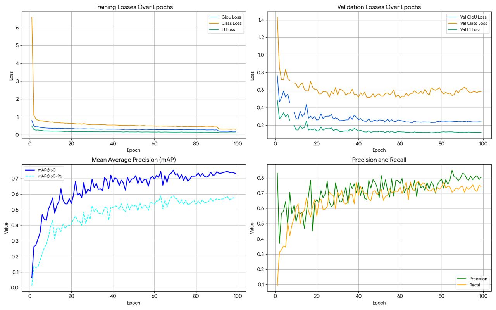
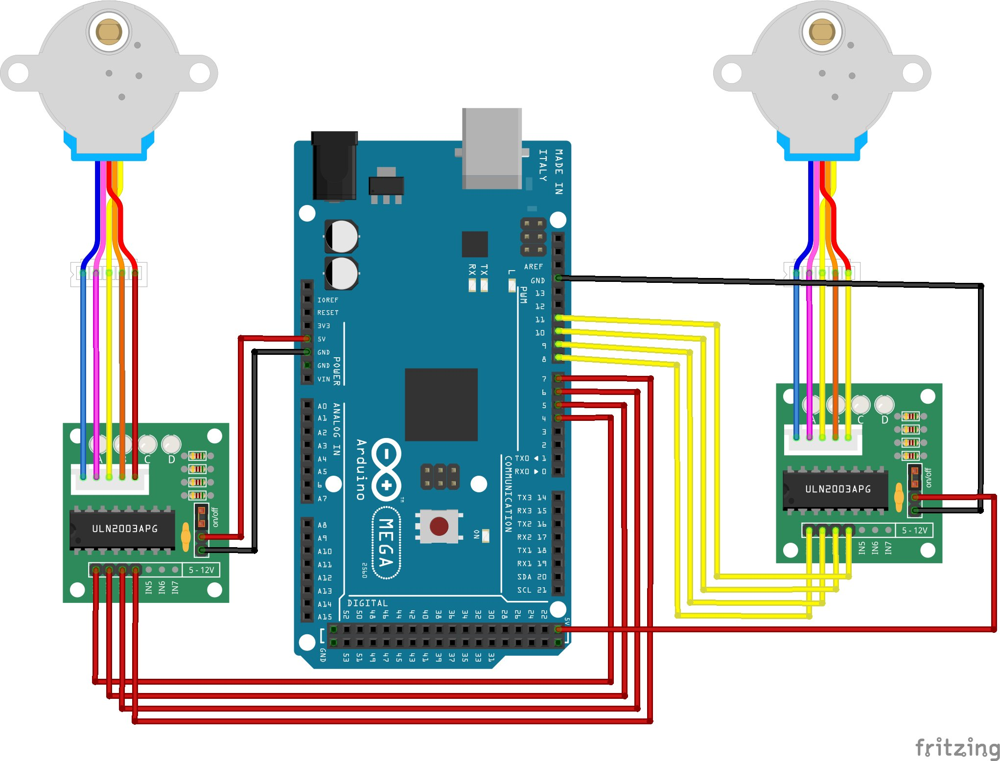
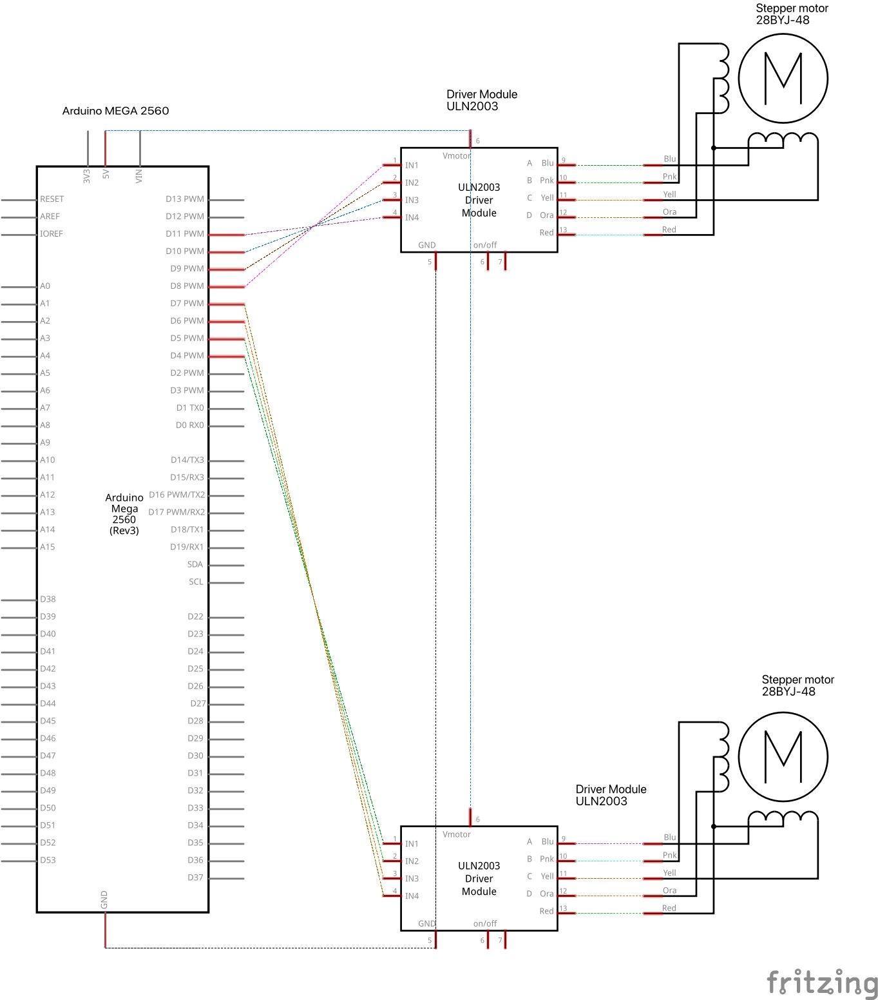

# fossil_pollen → ARM-2

Automated detection and classification of fossil pollen grains in microscope images. The project evolved in two phases:

- **Phase 1 (YOLO)** — multi-class object detection with YOLOv8, establishing the baseline pipeline and dataset.
- **Phase 2 (RT-DETR + hardware)** — upgraded detector, stronger metrics, and a fully autonomous motorised stage built around an Arduino MEGA and two 28BYJ-48 stepper motors so the microscope scans slides without human intervention.

---

## Results

### Model comparison — YOLO (baseline) vs RT-DETR-L (current)

| Metric | YOLOv8 (Phase 1) | RT-DETR-L (Phase 2) | Δ |
|---|---:|---:|---:|
| Precision | 0.679 | **0.811** | +0.132 |
| Recall | 0.603 | **0.734** | +0.131 |
| mAP@50 | 0.620 | **0.751** | +0.131 |
| mAP@50–95 | 0.482 | **0.590** | +0.108 |

RT-DETR-L trained for 100 epochs on a Tesla T4 (Google Colab, ~5 h).  
Dataset: **~2,500 microscopy images** · **24 palynological taxa** (incl. charcoal as a confounder).

<details>
<summary><strong>Per-class RT-DETR evaluation (click to expand)</strong></summary>

| Taxon | Val Images | Instances | P | R | mAP50 | mAP50-95 |
|---|---:|---:|---:|---:|---:|---:|
| **all** | **401** | **546** | **0.811** | **0.734** | **0.751** | **0.590** |
| Aconitum | 2 | 2 | 0.904 | 0.500 | 0.495 | 0.495 |
| Alnus viridis | 15 | 16 | 0.928 | 0.802 | 0.866 | 0.665 |
| Apiaceae | 9 | 9 | 1.000 | 0.939 | 0.995 | 0.765 |
| Artemisia | 62 | 69 | 0.869 | 0.863 | 0.847 | 0.605 |
| Asteraceae | 6 | 6 | 0.967 | 0.833 | 0.835 | 0.644 |
| Betula pendula | 23 | 24 | 0.837 | 0.875 | 0.834 | 0.659 |
| Charcoal | 38 | 40 | 0.767 | 0.906 | 0.849 | 0.572 |
| Chenopodiaceae | 26 | 26 | 0.952 | 0.771 | 0.832 | 0.652 |
| Convolvulus | 2 | 2 | 0.452 | 0.500 | 0.495 | 0.446 |
| Cyperaceae | 8 | 8 | 0.960 | 0.125 | 0.127 | 0.101 |
| Fagus | 2 | 2 | 0.482 | 0.500 | 0.495 | 0.396 |
| Galium | 1 | 1 | 0.430 | 1.000 | 0.995 | 0.895 |
| Juniperus | 4 | 4 | 1.000 | 0.437 | 0.495 | 0.396 |
| Lycopodium | 74 | 79 | 0.954 | 0.987 | 0.984 | 0.762 |
| Other_pollen | 19 | 20 | 0.860 | 0.350 | 0.363 | 0.281 |
| Pediastrum boryanum | 6 | 6 | 0.626 | 0.566 | 0.679 | 0.486 |
| Pediastrum integrum | 14 | 14 | 0.767 | 0.571 | 0.753 | 0.496 |
| Picea | 3 | 3 | 0.738 | 1.000 | 0.913 | 0.780 |
| Pine | 123 | 138 | 0.901 | 0.942 | 0.959 | 0.800 |
| Pinus stomata | 1 | 1 | 0.885 | 1.000 | 0.995 | 0.895 |
| Poaceae | 56 | 57 | 0.821 | 0.860 | 0.868 | 0.676 |
| Rumex | 9 | 9 | 0.688 | 0.667 | 0.720 | 0.537 |
| Salix | 8 | 8 | 0.728 | 0.625 | 0.629 | 0.509 |
| Thalictrum | 2 | 2 | 0.940 | 1.000 | 0.995 | 0.646 |

</details>

<p align="center">
  
  <br/><em>Training/validation losses, mAP and P–R curves over 100 epochs (RT-DETR-L).</em>
</p>

See [`results/example_predictions/`](results/example_predictions/) for annotated output images, and [`results/metrics.md`](results/metrics.md) for the full YOLO vs RT-DETR comparison.

---

## Hardware — automated microscope stage

<p align="center">
  
  <br/><em>Olympus CX41 microscope with motorised stage. Arduino MEGA + two 28BYJ-48 steppers visible bottom-right. Live RT-DETR feed on the laptop.</em>
</p>

### Bill of materials

| Component | Qty | Notes |
|---|---:|---|
| Arduino MEGA 2560 | 1 | Drives both motors via Firmata |
| 28BYJ-48 stepper motor (5 V) | 2 | One per axis (X, Y) |
| ULN2003 driver board | 2 | Bundled with the motors |
| Olympus CX41 microscope | 1 | Any compound microscope with a movable stage works |
| USB microscope camera | 1 | Any OpenCV-compatible camera |
| 3D-printed mounts | 3 | See `hardware/stl/` |
| Jumper wires, USB cable | — | |

### Wiring

<p align="center">
  
  <br/><em>Breadboard view — two 28BYJ-48 + ULN2003 stepper modules driven by an Arduino MEGA 2560.</em>
</p>

<p align="center">
  
  <br/><em>Equivalent schematic.</em>
</p>

| Axis | IN1 | IN2 | IN3 | IN4 |
|---|---:|---:|---:|---:|
| X motor | D4 | D5 | D6 | D7 |
| Y motor | D8 | D9 | D10 | D11 |

### 3D-printed parts (`hardware/stl/`)

| File | Purpose |
|---|---|
| `stage.stl` | Main stage extension that interfaces with the microscope's mechanical stage |
| `stage_mount.stl` | Bracket that anchors the X-motor and aligns it with the stage knob |
| `coupling.stl` | Adapter coupling linking the stepper output shaft to the focus / translation knob |

Print settings: **PLA · 0.2 mm layers · 30 % infill · no supports** (orient flat faces down).

---

## Software

### Architecture (Phase 2 — autonomous scan)

The Python application runs as **two cooperating threads**:

```
┌──────────────────────────────────┐         ┌──────────────────────────────────┐
│  Scanner thread                   │         │  Main / display thread            │
│  ─ drives X then Y motors         │ signal  │  ─ reads camera frames            │
│  ─ pauses at each position        │ ──────▶ │  ─ runs RT-DETR inference         │
│  ─ raises `capture_trigger`       │         │  ─ displays annotated feed        │
│  ─ waits for main to clear it     │ ◀────── │  ─ on trigger: saves img + CSV row │
└──────────────────────────────────┘  ack    └──────────────────────────────────┘
```

Live inference never blocks on motor moves; each logged detection is paired with the exact motor position that produced it.

### Installation

```bash
git clone https://github.com/bazenovaalima-sketch/fossil_pollen.git
cd fossil_pollen
python -m venv venv
source venv/bin/activate          # Windows: venv\Scripts\activate
pip install -r requirements.txt
```

Flash **StandardFirmata** to the Arduino MEGA — see [`arduino/README.md`](arduino/README.md).

### Configuration

Edit `src/config.py` to match your hardware:

```python
SERIAL_PORT    = "/dev/cu.usbmodem14101"   # Arduino port (Windows: "COM3" etc.)
CAMERA_INDEX   = 0
X_MOTOR_PINS   = [4, 5, 6, 7]
Y_MOTOR_PINS   = [8, 9, 10, 11]
MOVES_PER_AXIS = 10        # stops per axis
STEPS_PER_MOVE = 200       # half-steps between stops
PAUSE_SECONDS  = 2.0       # settle / focus time after each move
CONF_THRESHOLD = 0.30
MODEL_PATH     = "weights/best.pt"
```

### Run (autonomous scan)

```bash
python src/auto_scan.py
```

The script opens a live annotated window, steps the X axis through `MOVES_PER_AXIS` positions, logs detections to `auto_scan_log.csv` and saves annotated images to `captures/`, then repeats for the Y axis. Press **`q`** to stop cleanly.

### Run (YOLO inference — Phase 1 scripts)

Batch inference on a folder:
```bash
python inference/predict_folder.py --weights best.pt --input /path/to/images --conf 0.3
```

Real-time microscope feed (Windows / DirectShow):
```bash
python inference/realtime_microscope.py
```

---

## Repository structure

```
fossil_pollen/
├── README.md
├── requirements.txt
├── LICENSE
├── arduino/
│   └── README.md              ← how to flash StandardFirmata
├── docs/
│   └── images/
│       ├── setup.png
│       ├── breadboard.png
│       ├── schematic.png
│       └── training_metrics.jpg
├── hardware/
│   └── stl/
│       ├── stage.stl
│       ├── stage_mount.stl
│       └── coupling.stl
├── src/                       ← Phase 2: RT-DETR + autonomous scan
│   ├── config.py
│   ├── motor_control.py
│   └── auto_scan.py
├── training/
│   ├── train_yolo.py          ← Phase 1: YOLO training
│   └── README.md              ← RT-DETR training recipe
├── inference/                 ← Phase 1: YOLO inference scripts
│   ├── predict_folder.py
│   └── realtime_microscope.py
├── data/
│   └── README.md
├── results/
│   ├── metrics.md             ← YOLO vs RT-DETR comparison
│   └── example_predictions/  ← annotated output examples
│       ├── README.md
│       ├── example_good_01_pediastrum_chenopodiaceae.png
│       ├── example_good_02_artemisia_poaceae_lycopodium.png
│       ├── example_good_03_pine_lycopodium_poacea_charcoal.png
│       ├── example_good_04_pine_betula_poaceae.png
│       ├── example_good_05_alnus_viridis.png
│       ├── example_good_06_apiaceae.png
│       ├── example_good_07_steraceae.png
│       └── failure_cases/
│           ├── README.md
│           ├── failure_fn_pine.png
│           ├── failure_fp_chenopodiaceae.png
│           └── failure_fp_pinus_stomata.png
├── figures/
│   └── performance_figures/  ← YOLO evaluation figures
│       ├── BoxPR_curve.png
│       ├── confusion_matrix_normalized.png
│       └── map_per_class_bar.png
└── weights/
    └── best.pt               ← trained weights (use Git LFS or GitHub Release)
```

---

## Dataset

Custom dataset of **~2,500 microscopy images** from sediment samples at the Latoriței site (Southern Carpathians, Romania, depths 1101–1102 m, Late Glacial). Annotated with bounding boxes using Roboflow across 24 palynological taxa.

| Taxon | Count | Taxon | Count |
|---|---:|---|---:|
| Pine | 676 | Apiaceae | 31 |
| Lycopodium | 427 | Salix | 29 |
| Artemisia | 308 | Pinus stomata | 16 |
| Poaceae | 261 | Thalictrum | 16 |
| Charcoal | 226 | Juniperus | 15 |
| Betula pendula | 147 | Aconitum | 11 |
| Chenopodiaceae | 143 | Convolvulus | 11 |
| Pediastrum integrum | 92 | Fagus | 11 |
| Other_pollen | 81 | Galium | 10 |
| Alnus viridis | 66 | Picea | 10 |
| Rumex | 57 | | |
| Asteraceae | 52 | | |
| Pediastrum boryanum | 45 | | |
| Cyperaceae | 37 | | |

The dataset is class-imbalanced (Pine ≈ 23 % of all annotations). Class weighting and targeted oversampling of rare taxa are planned for v3.

---

## Future work

- **Z-axis autofocus** — third stepper on the fine-focus knob + Laplacian sharpness metric.
- **Whole-slide mosaic** — stitch fields of view into a panoramic image with per-grain coordinates.
- **Active learning** — surface low-confidence detections for human review and loop them back into training.
- **Class re-balancing** — targeted annotation of under-represented taxa (`Cyperaceae`, `Other_pollen`, `Fagus`).
- **Edge deployment** — port inference to a Jetson Nano for a fully standalone instrument.

---

## Citation

```bibtex
@misc{bazenova2026arm2,
  author = {Bazenova, Alima},
  title  = {ARM-2: Automated Fossil Pollen Recognition with RT-DETR and a Motorised Microscope Stage},
  year   = {2026},
  url    = {https://github.com/bazenovaalima-sketch/fossil_pollen}
}
```

## License

Code released under the **MIT License** — see [`LICENSE`](LICENSE).  
3D hardware files (`hardware/stl/`) released under **CERN-OHL-S v2**.

## Acknowledgments

Built with [Ultralytics](https://github.com/ultralytics/ultralytics) (RT-DETR & YOLO), [pyFirmata](https://github.com/tino/pyFirmata), and [OpenCV](https://opencv.org/).
